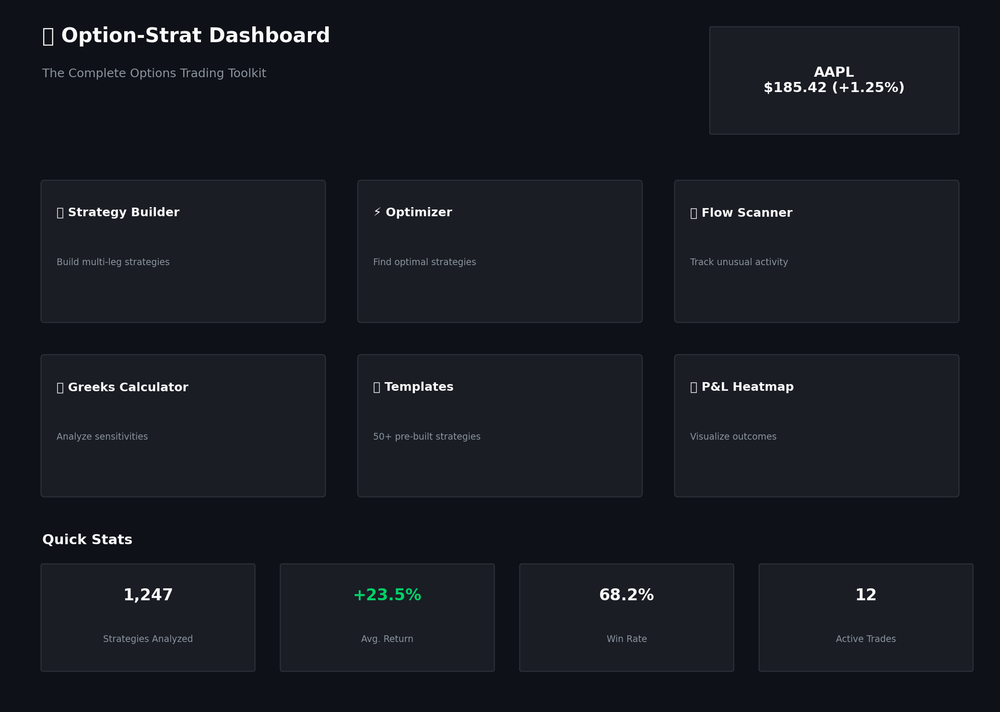
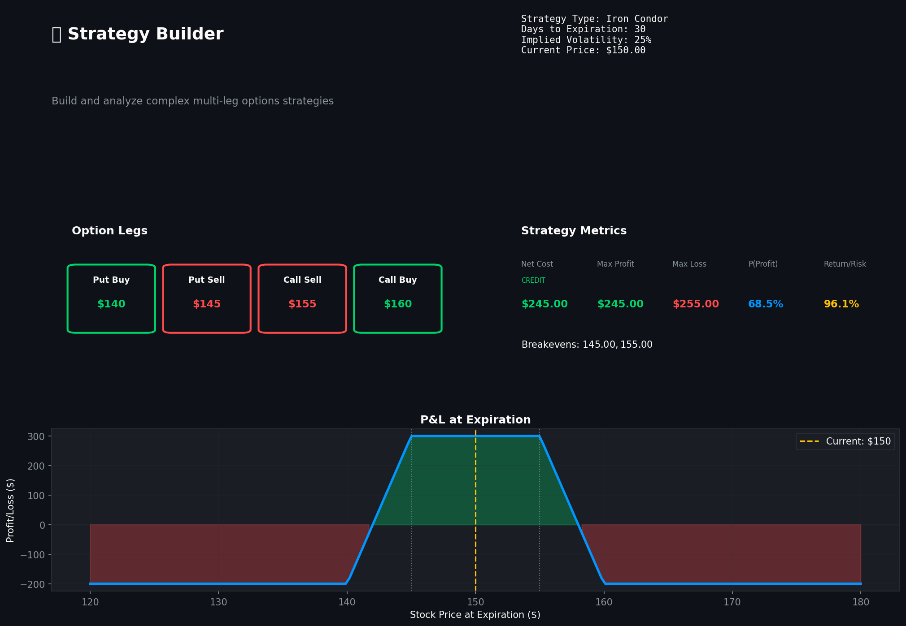
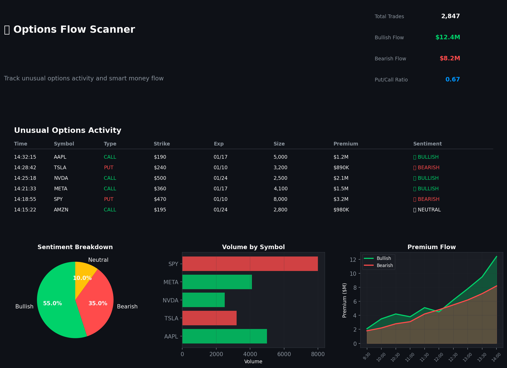
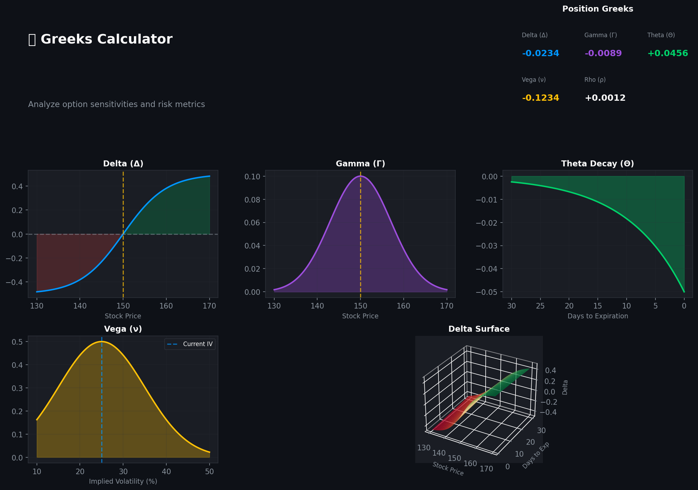
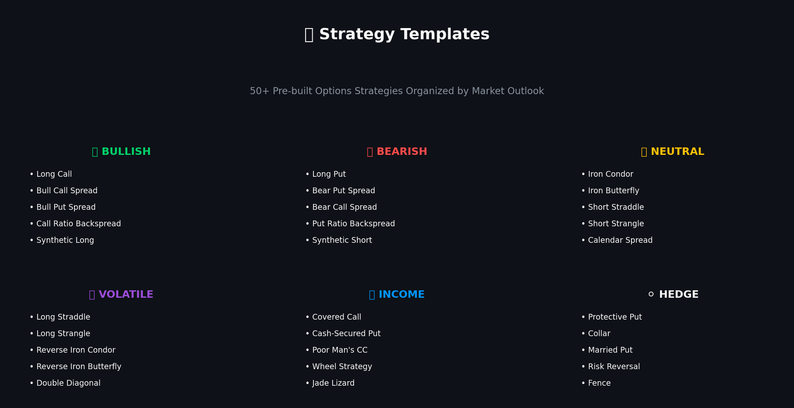
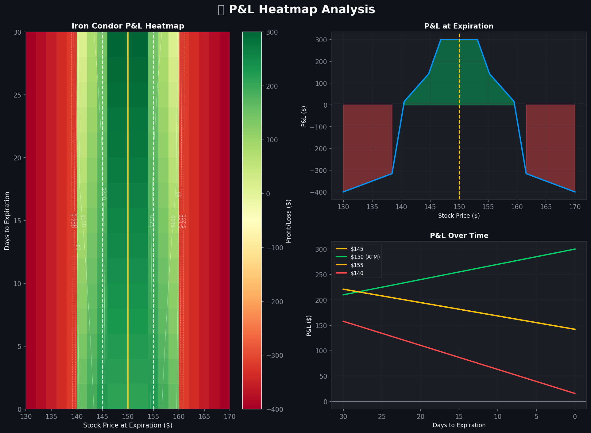
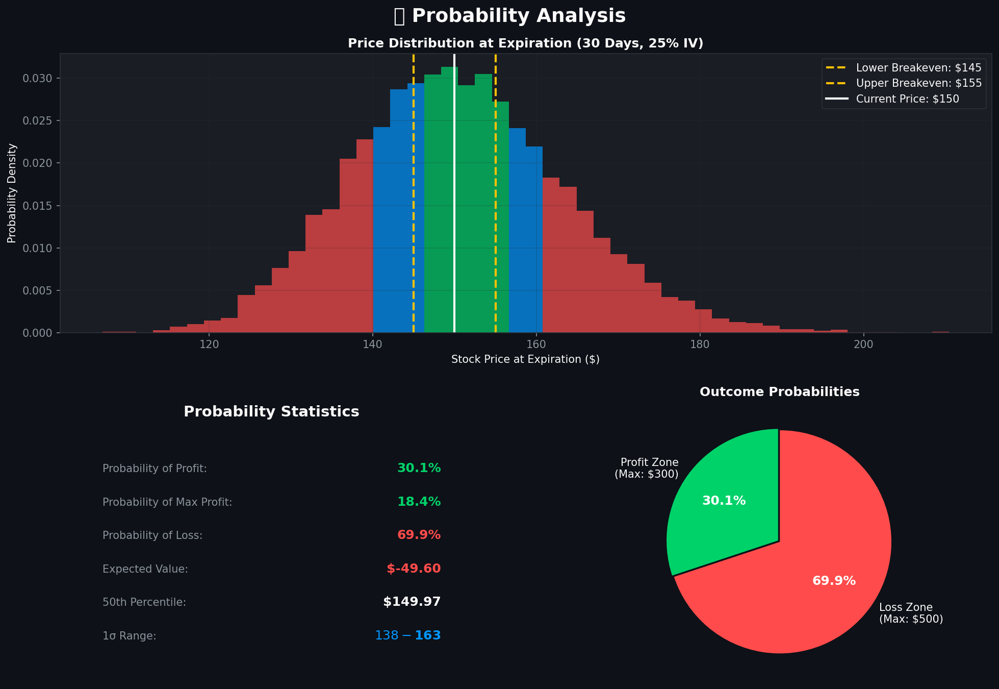

# Option-Strat

## The Complete Options Trading Toolkit

[](https://www.python.org/downloads/)
[](https://opensource.org/licenses/MIT)

Option-Strat is a comprehensive Python toolkit for options trading analysis, inspired by [OptionStrat.com](https://optionstrat.com). It provides everything you need to analyze, build, and optimize options strategies.

---

## Table of Contents

- [Features](#features)
- [Installation](#installation)
- [Quick Start](#quick-start)
- [Core Modules](#core-modules)
  - [Option Pricing (Black-Scholes)](#option-pricing-black-scholes)
  - [Greeks Calculation](#greeks-calculation)
  - [Strategy Builder](#strategy-builder)
  - [Strategy Templates](#strategy-templates)
  - [P&L Visualization](#pl-visualization)
  - [Options Flow Scanner](#options-flow-scanner)
  - [Strategy Optimizer](#strategy-optimizer)
- [CLI Usage](#cli-usage)
- [Web Dashboard](#web-dashboard)
- [Supported Strategies](#supported-strategies)
- [API Reference](#api-reference)
- [Examples](#examples)
- [Contributing](#contributing)
- [Disclaimer](#disclaimer)
- [License](#license)

---

## Features

### Core Functionality

- **Black-Scholes Option Pricing**: Accurate theoretical pricing for European options
- **Complete Greeks Suite**: Delta, Gamma, Theta, Vega, Rho + second-order Greeks (Vanna, Charm, Vomma, Speed)
- **50+ Pre-built Strategies**: From simple calls to complex iron condors
- **Multi-leg Strategy Builder**: Create custom strategies with any combination of options
- **P&L Visualization**: Interactive payoff diagrams, heatmaps, and probability distributions
- **Strategy Optimizer**: Find the best strategy for your market outlook
- **Options Flow Scanner**: Track unusual options activity and smart money

### Interfaces

- **Python API**: Full programmatic access to all features
- **CLI Tool**: Command-line interface for quick analysis
- **Web Dashboard**: Interactive Streamlit-based web interface

### Data Sources

- **Yahoo Finance Integration**: Real market data (optional)
- **Simulated Data**: Built-in realistic data simulation for testing

---

## Installation

### Requirements

- Python 3.9 or higher
- pip package manager

### Install from Source

```bash
# Clone the repository
git clone https://github.com/yourusername/Option-Strat.git
cd Option-Strat

# Create virtual environment (recommended)
python -m venv venv
source venv/bin/activate  # On Windows: venv\Scripts\activate

# Install dependencies
pip install -r requirements.txt

# Install package in development mode
pip install -e .
```

### Dependencies

```
numpy>=1.24.0          # Numerical computing
pandas>=2.0.0          # Data manipulation
scipy>=1.10.0          # Scientific computing
matplotlib>=3.7.0      # Static charts
plotly>=5.15.0         # Interactive charts
streamlit>=1.28.0      # Web dashboard
yfinance>=0.2.28       # Market data
rich>=13.5.0           # CLI formatting
click>=8.1.0           # CLI framework
```

---

## Quick Start

### Python API

```python
from optionstrat import Option, StrategyBuilder, PayoffVisualizer

# Create a simple call option
call = Option(
    option_type='call',
    strike=150,
    expiry_days=30,
    underlying_price=145,
    volatility=0.25
)

# View option details
print(f"Price: ${call.price:.2f}")
print(f"Delta: {call.delta:.4f}")
print(f"Theta: {call.theta:.4f} per day")
print(f"P(ITM): {call.probability_itm*100:.1f}%")

# Build a complex strategy
builder = StrategyBuilder("AAPL", underlying_price=150, volatility=0.25)

iron_condor = builder.iron_condor(
    put_buy=140,
    put_sell=145,
    call_sell=155,
    call_buy=160,
    expiry_days=30
)

# Analyze strategy
print(iron_condor.summary())
print(f"Max Profit: ${iron_condor.max_profit:.2f}")
print(f"Max Loss: ${iron_condor.max_loss:.2f}")
print(f"P(Profit): {iron_condor.probability_of_profit()*100:.1f}%")

# Visualize payoff
viz = PayoffVisualizer(iron_condor)
viz.plot_payoff()
viz.plot_pnl_heatmap()
```

### CLI

```bash
# Analyze a strategy
optionstrat analyze AAPL --strategy iron_condor --expiry 30

# Find optimal strategies
optionstrat optimize TSLA --target 280 --days 14

# Monitor options flow
optionstrat flow --symbol SPY --min-premium 100000

# Calculate Greeks
optionstrat greeks AAPL --strike 150 --type call --expiry 30
```

### Web Dashboard

```bash
# Start the Streamlit dashboard
streamlit run app.py

# Open browser to http://localhost:8501
```

---

## Core Modules

### Option Pricing (Black-Scholes)

The `BlackScholes` class implements the Black-Scholes-Merton model for pricing European options.

```python
from optionstrat.models.pricing import BlackScholes

# Create model
bs = BlackScholes(
    S=100,      # Current stock price
    K=105,      # Strike price
    T=30/365,   # Time to expiry in years
    r=0.05,     # Risk-free rate
    sigma=0.25, # Volatility
    q=0.01      # Dividend yield (optional)
)

# Get prices
call_price = bs.call_price()
put_price = bs.put_price()

# Get Greeks
delta = bs.delta('call')
gamma = bs.gamma()
theta = bs.theta('call')  # Per day
vega = bs.vega()          # Per 1% IV change

# Probability calculations
prob_itm = bs.probability_itm('call')
prob_touch = bs.probability_touch('call')

# Implied volatility
iv = BlackScholes.implied_volatility(
    market_price=5.50,
    S=100,
    K=105,
    T=30/365,
    r=0.05,
    option_type='call'
)
```

### Greeks Calculation

The `Greeks` class provides comprehensive Greeks calculation and aggregation.

```python
from optionstrat.models.greeks import Greeks, GreeksCalculator

# Calculate all Greeks at once
greeks = GreeksCalculator.calculate_all(
    S=100,
    K=105,
    T=30/365,
    r=0.05,
    sigma=0.25,
    option_type='call',
    include_second_order=True
)

print(f"Delta: {greeks.delta:.4f}")
print(f"Gamma: {greeks.gamma:.4f}")
print(f"Theta: {greeks.theta:.4f}")
print(f"Vega: {greeks.vega:.4f}")
print(f"Vanna: {greeks.vanna:.4f}")
print(f"Charm: {greeks.charm:.4f}")

# Greeks over price range
price_greeks = GreeksCalculator.greeks_over_price(
    S=100, K=105, T=30/365, r=0.05, sigma=0.25,
    option_type='call', price_range=0.3
)

# Greeks over time
time_greeks = GreeksCalculator.greeks_over_time(
    S=100, K=105, T=30/365, r=0.05, sigma=0.25,
    option_type='call', time_points=30
)
```

### Strategy Builder

The `StrategyBuilder` class provides methods for creating all common options strategies.

```python
from optionstrat.strategies.builder import StrategyBuilder

builder = StrategyBuilder(
    symbol="AAPL",
    underlying_price=150,
    volatility=0.25,
    risk_free_rate=0.05
)

# Basic strategies
long_call = builder.long_call(strike=155, expiry_days=30)
long_put = builder.long_put(strike=145, expiry_days=30)

# Vertical spreads
bull_call = builder.bull_call_spread(buy_strike=150, sell_strike=160, expiry_days=30)
bear_put = builder.bear_put_spread(buy_strike=150, sell_strike=140, expiry_days=30)

# Iron strategies
iron_condor = builder.iron_condor(
    put_buy=135, put_sell=140,
    call_sell=160, call_buy=165,
    expiry_days=30
)

iron_butterfly = builder.iron_butterfly(
    wing_put=140, body_strike=150, wing_call=160,
    expiry_days=30
)

# Volatility strategies
straddle = builder.long_straddle(strike=150, expiry_days=30)
strangle = builder.long_strangle(put_strike=145, call_strike=155, expiry_days=30)

# Calendar spreads
calendar = builder.call_calendar_spread(
    strike=150,
    front_expiry_days=14,
    back_expiry_days=45
)

# Diagonal spreads
diagonal = builder.call_diagonal_spread(
    front_strike=155,
    back_strike=150,
    front_expiry_days=14,
    back_expiry_days=45
)

# Custom strategy
custom = builder.custom(
    name="My Custom Strategy",
    legs=[
        {'option_type': 'call', 'strike': 150, 'expiry_days': 30, 'quantity': 1},
        {'option_type': 'put', 'strike': 145, 'expiry_days': 30, 'quantity': -1},
    ]
)
```

### Strategy Templates

Pre-configured strategy templates for common trading scenarios.

```python
from optionstrat.strategies.templates import StrategyTemplates, MarketOutlook

templates = StrategyTemplates(
    symbol="AAPL",
    underlying_price=150,
    volatility=0.25
)

# List all templates
all_templates = templates.list_all()
for name, info in all_templates.items():
    print(f"{name}: {info['description']}")

# Get templates by outlook
bullish = templates.get_by_outlook(MarketOutlook.BULLISH)
bearish = templates.get_by_outlook(MarketOutlook.BEARISH)
neutral = templates.get_by_outlook(MarketOutlook.NEUTRAL)
volatile = templates.get_by_outlook(MarketOutlook.VOLATILE)

# Create strategy from template
strategy = templates.create("iron_condor_standard", expiry_days=30)

# Get suggestions based on criteria
suggestions = templates.suggest(
    outlook=MarketOutlook.BULLISH,
    max_loss=500
)

# Compare templates
comparison = templates.compare(
    ["iron_condor_standard", "iron_butterfly", "short_strangle"],
    expiry_days=30
)
```

### P&L Visualization

Comprehensive visualization tools for strategy analysis.

```python
from optionstrat.visualization.payoff import PayoffVisualizer, compare_strategies
from optionstrat.visualization.greeks_chart import GreeksVisualizer

# Payoff visualization
viz = PayoffVisualizer(strategy)

# Static payoff diagram
fig = viz.plot_payoff(
    show_breakevens=True,
    show_max_profit_loss=True,
    show_current_price=True
)

# P&L heatmap over price and time
fig = viz.plot_pnl_heatmap(
    price_points=50,
    time_points=20
)

# Interactive Plotly chart
fig = viz.plot_interactive(show_legs=True)

# Probability distribution
fig = viz.plot_probability_distribution(num_simulations=10000)

# ASCII P&L table
print(viz.plot_pnl_table())

# Compare multiple strategies
fig = compare_strategies([iron_condor, butterfly, straddle])

# Greeks visualization
greeks_viz = GreeksVisualizer(strategy)

# Greeks vs price
fig = greeks_viz.plot_greeks_vs_price()

# Greeks over time
fig = greeks_viz.plot_greeks_over_time()

# 3D Greeks surface
fig = greeks_viz.plot_greek_surface(greek='delta')

# Interactive Greeks dashboard
fig = greeks_viz.plot_interactive_greeks()
```

### Options Flow Scanner

Track and analyze options flow activity.

```python
from optionstrat.flow.scanner import FlowScanner, FlowFilter, Sentiment

scanner = FlowScanner()

# Create filter
flow_filter = FlowFilter(
    symbols=['AAPL', 'TSLA', 'SPY'],
    min_premium=100000,
    only_unusual=True,
    sentiments=[Sentiment.BULLISH, Sentiment.BEARISH]
)

# Get flow data
trades = scanner.get_flow(flow_filter, limit=50)

# Display trades
for trade in trades[:10]:
    print(trade.summary())

# Aggregate statistics
by_symbol = scanner.aggregate_by_symbol(trades)
by_sentiment = scanner.aggregate_by_sentiment(trades)

# Get top trades
top_by_premium = scanner.get_top_trades(trades, by='premium', limit=10)
top_by_size = scanner.get_top_trades(trades, by='size', limit=10)

# Flow summary
print(scanner.flow_summary(trades))

# Set up alerts
alert_id = scanner.add_alert(
    name="Large AAPL Calls",
    filter=FlowFilter(symbols=['AAPL'], min_premium=500000),
    callback=lambda trade: print(f"Alert! {trade.summary()}")
)

# Check alerts
triggered = scanner.check_alerts(trades)
```

### Strategy Optimizer

Find optimal strategies for your market outlook.

```python
from optionstrat.optimizer.optimizer import StrategyOptimizer, OptimizationGoal

optimizer = StrategyOptimizer(
    symbol="AAPL",
    underlying_price=150,
    volatility=0.25
)

# Find optimal strategies for a target
results = optimizer.optimize(
    target_price=165,           # Expected price
    target_days=14,             # Days to target
    goal=OptimizationGoal.MAX_RETURN,
    max_results=10,
    max_loss=1000,              # Filter by max loss
    min_probability=0.3         # Filter by probability
)

# Display results
for result in results:
    print(result.summary())

# Find optimal strikes for a specific strategy
best = optimizer.optimize_strikes(
    strategy_type='iron_condor',
    target_price=165,
    target_days=14,
    expiry_days=21
)

# Compare strategy types
comparison = optimizer.compare_strategies(
    target_price=165,
    target_days=14,
    strategies=['iron_condor', 'bull_call_spread', 'long_straddle']
)

# Find best expiry
expiry_results = optimizer.find_best_expiry(
    strategy_type='iron_condor',
    target_price=165,
    target_days=14,
    expiry_min=7,
    expiry_max=60
)

# Full optimization report
print(optimizer.summary_report(target_price=165, target_days=14))
```

---

## CLI Usage

### Available Commands

```bash
# Analyze a strategy
optionstrat analyze SYMBOL [OPTIONS]
  --strategy, -s    Strategy type (default: iron_condor)
  --expiry, -e      Days to expiration (default: 30)
  --volatility, -v  Implied volatility (default: 0.25)

# Find optimal strategies
optionstrat optimize SYMBOL [OPTIONS]
  --target, -t      Target price (required)
  --days, -d        Days to target (required)
  --goal, -g        Optimization goal (default: max_return)
  --max-results, -n Number of results (default: 5)

# Monitor options flow
optionstrat flow [OPTIONS]
  --symbol, -s      Filter by symbol
  --min-premium, -p Minimum premium
  --unusual, -u     Only unusual activity
  --limit, -n       Number of trades

# Calculate Greeks
optionstrat greeks SYMBOL [OPTIONS]
  --strike, -k      Strike price (required)
  --type, -t        Option type: call/put (required)
  --expiry, -e      Days to expiration (required)
  --volatility, -v  Implied volatility

# Compare strategies
optionstrat compare SYMBOL [OPTIONS]
  --strategies, -s  Comma-separated strategy list
  --expiry, -e      Days to expiration

# List strategy templates
optionstrat templates

# Interactive mode
optionstrat interactive
```

### Examples

```bash
# Analyze an iron condor on AAPL
optionstrat analyze AAPL --strategy iron_condor --expiry 30

# Find best strategies for bullish TSLA outlook
optionstrat optimize TSLA --target 280 --days 14 --goal max_return

# Monitor large options flow
optionstrat flow --min-premium 250000 --unusual

# Calculate Greeks for SPY call
optionstrat greeks SPY --strike 480 --type call --expiry 30

# Compare multiple strategies
optionstrat compare NVDA --strategies "iron_condor,bull_call_spread,long_straddle"
```

---

## Web Dashboard

The Streamlit-based web dashboard provides an interactive interface for all features.

### Starting the Dashboard

```bash
streamlit run app.py
# Open browser to http://localhost:8501
```

---

### Dashboard Overview

Main dashboard interface with navigation and quick stats overview.



---

### Strategy Builder

Build and analyze complex multi-leg options strategies with real-time P&L visualization.



---

### Strategy Optimizer

Find optimal strategies for your target price and timeframe with intelligent ranking.


---

### Options Flow Scanner

Monitor unusual options activity and track smart money movements in real-time.



---

### Greeks Calculator

Calculate and visualize all Greeks for any option with interactive charts.



---

### Strategy Templates

Browse 50+ pre-configured strategy templates organized by market outlook.



---

### P&L Heatmap

Interactive heatmap showing profit/loss across price and time dimensions.



---

### Probability Distribution

Monte Carlo simulation showing the probability distribution of outcomes.



---

## Supported Strategies

### Basic Strategies
- Long Call / Short Call
- Long Put / Short Put

### Vertical Spreads
- Bull Call Spread
- Bear Call Spread (Call Credit Spread)
- Bull Put Spread (Put Credit Spread)
- Bear Put Spread

### Iron Strategies
- Iron Condor (Standard, Wide, Narrow)
- Iron Butterfly
- Reverse Iron Condor

### Butterfly Strategies
- Long Call Butterfly
- Long Put Butterfly
- Short Call Butterfly
- Broken Wing Butterfly

### Condor Strategies
- Long Call Condor
- Long Put Condor

### Volatility Strategies
- Long Straddle / Short Straddle
- Long Strangle / Short Strangle
- Long Guts / Short Guts

### Calendar Strategies
- Call Calendar Spread
- Put Calendar Spread
- Double Calendar

### Diagonal Strategies
- Call Diagonal Spread
- Put Diagonal Spread
- Poor Man's Covered Call

### Income Strategies
- Covered Call
- Protective Put
- Cash-Secured Put
- Collar

### Ratio Strategies
- Call Ratio Spread
- Put Ratio Spread
- Call Backspread
- Put Backspread

### Synthetic Strategies
- Synthetic Long Stock
- Synthetic Short Stock
- Risk Reversal

### Advanced Strategies
- Jade Lizard
- Twisted Sister
- Christmas Tree (Calls/Puts)
- Box Spread

---

## API Reference

### Classes

| Class | Description |
|-------|-------------|
| `Option` | Single option contract with pricing and Greeks |
| `OptionLeg` | Option with position (long/short) and quantity |
| `Strategy` | Multi-leg options strategy |
| `Greeks` | Container for Greeks values |
| `BlackScholes` | Black-Scholes pricing model |
| `StrategyBuilder` | Factory for creating strategies |
| `StrategyTemplates` | Pre-configured strategy templates |
| `PayoffVisualizer` | P&L visualization tools |
| `GreeksVisualizer` | Greeks visualization tools |
| `FlowScanner` | Options flow analysis |
| `FlowTrade` | Single flow trade record |
| `FlowFilter` | Filter criteria for flow scanning |
| `StrategyOptimizer` | Strategy optimization engine |

### Key Methods

```python
# Option
option.price                  # Option price
option.delta / gamma / theta  # Greeks
option.greeks                 # All Greeks as object
option.probability_itm        # P(ITM) at expiry
option.breakeven              # Breakeven price
option.payoff_at_expiry(p)   # Payoff at price p

# Strategy
strategy.net_premium         # Net cost/credit
strategy.max_profit          # Maximum profit
strategy.max_loss            # Maximum loss
strategy.breakevens          # List of breakevens
strategy.profit_at_expiry(p) # P&L at price p
strategy.greeks              # Aggregated Greeks
strategy.probability_of_profit()  # P(profit)
strategy.summary()           # Formatted summary

# StrategyBuilder
builder.iron_condor(...)     # Create iron condor
builder.bull_call_spread(...) # Create bull call spread
builder.custom(...)          # Create custom strategy

# Visualizer
viz.plot_payoff()            # Payoff diagram
viz.plot_pnl_heatmap()       # P&L heatmap
viz.plot_interactive()       # Interactive Plotly chart

# Optimizer
optimizer.optimize(...)      # Find optimal strategies
optimizer.compare_strategies(...) # Compare strategy types
```

---

## Examples

### Example 1: Analyze an Iron Condor

```python
from optionstrat import StrategyBuilder, PayoffVisualizer

# Create builder
builder = StrategyBuilder("SPY", underlying_price=475, volatility=0.15)

# Build iron condor
ic = builder.iron_condor(
    put_buy=455,
    put_sell=460,
    call_sell=490,
    call_buy=495,
    expiry_days=30
)

# Display analysis
print(ic.summary())

# Visualize
viz = PayoffVisualizer(ic)
viz.plot_payoff()
```

### Example 2: Find Optimal Strategy for Earnings

```python
from optionstrat import StrategyOptimizer, OptimizationGoal

# Expecting 10% move after earnings
optimizer = StrategyOptimizer("NFLX", underlying_price=450, volatility=0.60)

results = optimizer.optimize(
    target_price=495,  # Bullish bias
    target_days=3,     # Right after earnings
    goal=OptimizationGoal.MAX_RETURN,
    max_results=5
)

for r in results:
    print(f"{r.rank}. {r.strategy.name}: ${r.expected_return:.2f} ({r.probability_of_profit*100:.1f}%)")
```

### Example 3: Monitor Smart Money

```python
from optionstrat import FlowScanner, FlowFilter, Sentiment

scanner = FlowScanner()

# Filter for large bullish bets
filter = FlowFilter(
    min_premium=250000,
    sentiments=[Sentiment.BULLISH],
    only_unusual=True
)

trades = scanner.get_flow(filter, limit=20)

print(scanner.flow_summary(trades))

for trade in trades[:5]:
    print(trade.summary())
```

---

## Contributing

Contributions are welcome! Please feel free to submit a Pull Request.

1. Fork the repository
2. Create your feature branch (`git checkout -b feature/AmazingFeature`)
3. Commit your changes (`git commit -m 'Add some AmazingFeature'`)
4. Push to the branch (`git push origin feature/AmazingFeature`)
5. Open a Pull Request

---

## Disclaimer

**This software is for educational and informational purposes only.**

- This is NOT financial advice
- Options trading involves significant risk of loss
- Past performance does not guarantee future results
- Always do your own research before trading
- Consult with a qualified financial advisor

The authors and contributors are not responsible for any financial losses incurred through the use of this software.

---

## License

This project is licensed under the MIT License - see the [LICENSE](LICENSE) file for details.

---

## Acknowledgments

- Inspired by [OptionStrat.com](https://optionstrat.com)
- Black-Scholes model implementation based on standard financial mathematics
- Thanks to the open-source community for the amazing libraries used in this project

---

## Support

- **Issues**: [GitHub Issues](https://github.com/yourusername/Option-Strat/issues)
- **Discussions**: [GitHub Discussions](https://github.com/yourusername/Option-Strat/discussions)

---

Made with Python and passion for options trading